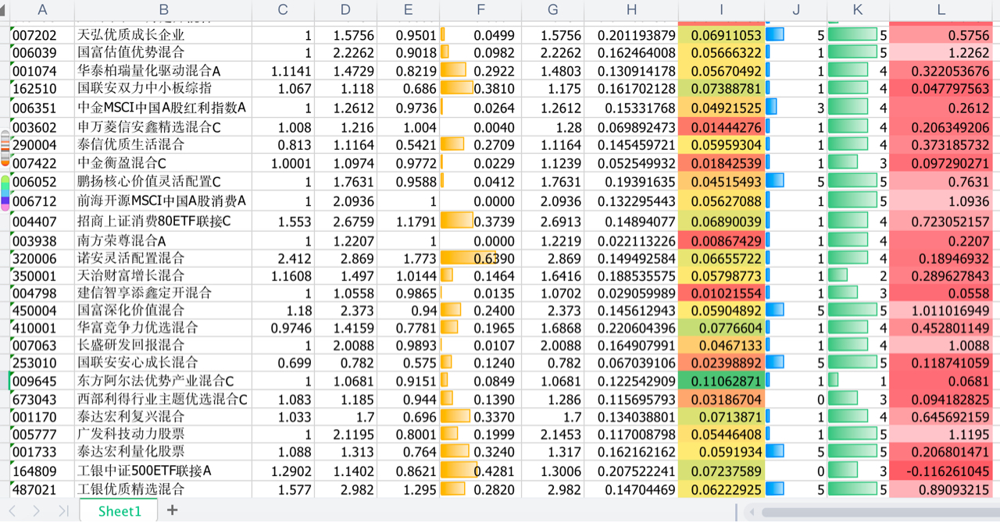
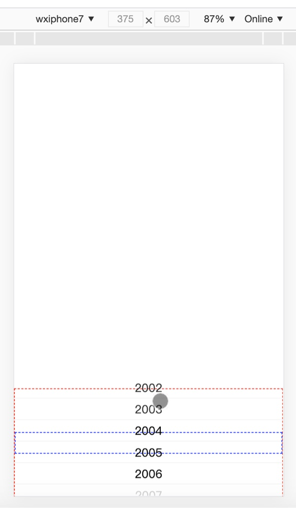

# PrdList
记录这几年做过的产品列表


## 沪深主流基金月度绩效
```text
项目介绍：每月兜取沪深主流股票型基金，按照主要量化指标，寻找输出最稳的基金并买入持有
技术栈：NodeJs
详细地址：https://github.com/zacard-orc/FundInfo.git
```
 


## Vue兴趣代码片断
```text
项目介绍：Vue2.0下一些感兴趣的组件代码片段
技术栈：Vue2.0
详细地址：https://github.com/zacard-orc/vw3.git
```
 

